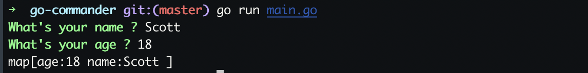

# go-commander
A commander tool written with go

### useage
```
# install
gopm -g -v -u github.com/scott-x/go-commander
```
### Code Example
```
package main

import (
	"github.com/scott-x/go-commander/cmd"
	"fmt"
)
func main(){
   cmd.AddQuestion("name","What's your name ? ","Please input correct name: ","[a-z]+")
   cmd.AddQuestion("age","What's your age ? ","Please input correct age: ","[0-9]{2}")
   a :=cmd.Exec()
   fmt.Println(a) 
   //anycode here ...
}   

```
### A REFERENCE IMAGE
